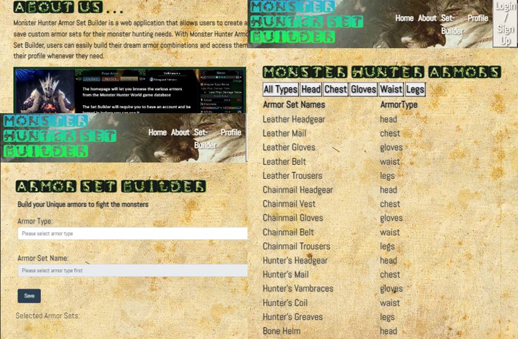

# Monster Hunter Armor Set Builder
[Monster Hunter Armor Set Builder](https://mhs-project-f0451302321b.herokuapp.com/login) is a web application that allows users to create and save custom armor sets for their monster hunting needs.  With Monster Hunter Armor Set Builder, users can easily build their dream armor combinations and access them in their profile whenever they need.

## Table of Contents
- [Features](#features)
- [Getting Started](#getting-started)
- [Technologies Used](#technologies-used)
- [Installation](#installation)
- [Contribution](#how-to-contribute)
- [Contact](#contact)
- [Credits](#credits)


```md
# User Story
As a user  
I want to be able to visit the Armor Builder website and create personalized armor sets.   
I want to have the ability to select different armor types and choose specific armor sets for each type.   
Once I have built my armor sets, I want to be able to save them and view them in my profile.  
This way, I can easily access and reference my custom armor sets before starting a gaming session.
```
# Features
User authentication: Users can sign up for an account and log in to access the Armor Builder features.

Armor selection: Users can choose from various armor types and select specific armor sets for each type.

Dynamic interface: The interface dynamically updates based on user selections, providing a seamless armor-building experience.

Save functionality: Users can save their built armor sets and have them associated with their account.

Profile page: Users can view their saved armor sets in their profile, allowing them to review and reference their custom armor combinations.


# Getting Started

To get started with Armor Builder, follow these steps:

Visit the Armor Builder website 
Sign up for a new account by providing your email address and creating a password.
Log in to your account using your credentials.
Start building your custom armor sets by selecting the desired armor types and choosing specific armor sets for each type.
Save your armor sets to have them associated with your account.
Access your profile to view.


# Technologies Used

Front-end: HTML, CSS, JavaScript
Back-end: Node.js, Express.js
Database: MySql


# Installation
Clone the Armor Builder repository from GitHub.
Install the required dependencies using npm.
Start the application using the appropriate npm command.
Access the application through your preferred web browser.


# How to Contribute

Contributions to Armor Builder are welcome! If you find any bugs or have suggestions for new features, please create an issue on the GitHub repository. If you would like to contribute code, please fork the repository and submit a pull request with your changes.

# License
This project is licensed under the MIT License.   [](https://choosealicense.com/licenses/mit/.)

# Contact
For any inquiries or support, please email us.

Thank you for choosing Armor Builder for your armor customization needs! Enjoy building and saving your unique armor sets for epic gaming experiences.

# Credits

Credits to  the help of instruction and guidance of the staff of the UofM coding boot camp, the resources at W3 and the Mozilla Developers Network.  


Abdulla Ahmed  https://github.com/Aiahmed01  
Leng Chang  https://github.com/Ren-kun235  
Kaleb Aguirre  https://github.com/KalebAguirre  
Chee Lor  https://github.com/CML120  

# Sources for various assets and images

Nav Background: https://www.wallpaperflare.com/video-game-monster-hunter-world-anjanath-monster-hunter-wallpaper-sijhf  
Wallpaper:  https://wallpaperaccess.com/ancient-paper   
Mouse Cursor: https://vsthemes.org/en/cursors/3116-mhw.html   


